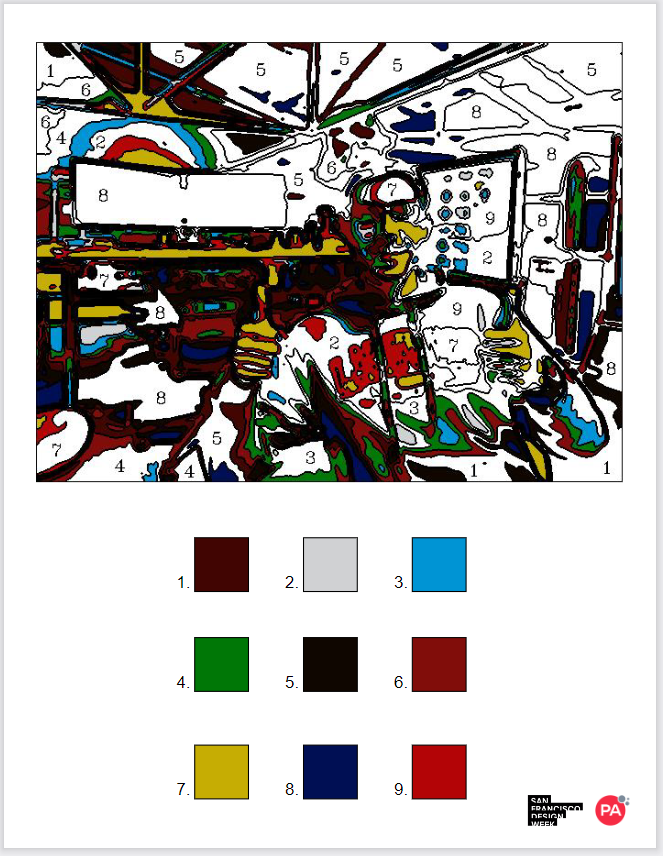

# Paint-By-Number

## Table of Contents
- [Overview](#overview)
- [How it Works](#how-it-works)
- [How to Run](#how-to-run)
- [Example Image Outputs](#example-image-outputs)
- [Example PDF Output](#example-image-output)
- [Future Improvements](#future-improvements)

## Overview
This project was used to explore OpenCV, image-to-image generation, and hone existing Python skills. It transforms any image into a paint-by-number image. The Stability AI platform is integrated to allow the user to perform Image-to-Image generation based on the original input image. Using this AI generation is not essential for the main functionality. 

## How it Works
1. [Image Input](#image-input)
2. [Image-to-Image Generation (optional)](#image-to-image-generation-optional)
3. [Color Quantization](#color-quantization)
4. [Color Masking](#color-masking)
5. [Finding Contours and Label Locations](#finding-contours-and-label-locations)
6. [Combining Masks and Drawing Contours/Labels](#combining-masks-and-drawing-contourslabels)
7. [PDF Generation](#pdf-generation)
8. [Printing](#printing)
9. [GUI](#gui)

### Image Input
Images are loaded using cv.imread("/file_path"). Example images have been stored in the 'images' folder and can be easily swapped by uncommenting the corresponding image line.

### Image-to-Image Generation (optional)
The method of calling the Stability AI comes from the [Stability AI's python tutorial](https://platform.stability.ai/docs/features/image-to-image#Python). A PIL image must be used, so the OpenCV input image is converted. The output of the API call is also a PIL image, so this image is converted back into a numpy array for usage in the rest of the script. In the Generation Parameters section, the user can edit the prompt and the strength of the prompt.

The user must create their own Stability AI account in order to get a unique API token. With the new account comes 25 free credits, additional credit may be purchased. Save the unique API token locally in a .txt file (not in the repository!) and update the api_token_file with the path to where the API token is saved.

There is a filter that throws a warning if the adult classifier is tripped to ensure no inappropriate images are shown.

Image-to-image generation is not needed for the script to run succesfully. If the user prefers paint-by-number of the original image than this section can be skipped by setting the *USE_AI* value to False.

### Color Quantization
The script performs color quantization using k-means clustering to reduce the number of colors in the output image to a user-set number (variable name is *color_quantity*), making it possible to paint by hand.

This is accomplished by first applying a Gaussian blur is applied to the image, which is a way of smoothing out the pixels and making them less sharp. This helps to reduce the noise and make the edges more clear.

Next, the k-means clustering algorithm is run, which is a way of grouping similar data points together. The code uses the cv.kmeans function, which takes six arguments: the input data, **the number of clusters (*color_quantity*)**, the initial labels, the criteria for stopping the algorithm, the number of attempts, and the method of choosing the initial cluster centers. The output of the cv.kmeans function are three values: the final error, the final labels, and the final cluster centers. The final labels are the final colors used for painting, these values are saved in the variable *base_colors*.

### Color Masking
 A mask is a way of selecting or hiding certain parts of an image based on some criteria. The is done in three steps:

1. It calculates the maximum and minimum values for each base color, using a tolerance of 5. This means that any pixel that is within 5 units of the base color will be considered part of the same cluster. It stores these values in a dictionary, where the key is the cluster index and the value is a pair of arrays representing the lower and upper limits of the color range.
2. It creates masks for each base color, using the cv.inRange function. This function takes the simplified image, the lower and upper limits of the color range, and returns a binary image where each pixel that falls within the range is set to white (255) and the rest are set to black (0). It stores these masks in another dictionary, where the key is the cluster index and the value is the mask image.
3. It applies the masks to the simplified image, using the cv.bitwise_and function. This function takes the simplified image, a copy of the simplified image, and a mask image, and returns an image where only the pixels that are white in the mask are kept from the simplified image. It stores these masked images in a third dictionary, where the key is the cluster index and the value is the masked image.

### Finding Contours and Label Locations
First, the *findContours* is used to collect the contours of every mask. This will be used for drawing the final image.

Using the openCV function connectComponents, the script is now able to break masked region into independent areas or 'blobs'. Next, one at a time, each blob is drawn on top of an empty mask so there is a black background with a single white blob on it. This single-blob mask is then passed into the *find_label_location* function. *find_label_location* uses distanceTransform to find the furthest any point in the blob is away from the border. This is the optimal location for the number label because it has the most amount of space around it for readability purposes. These locations are saved in *label_locations_dict*.

Important note: distanceTransform function doesn’t consider the border of the image as an edge. As a result, it labels the border as the farthest point from any other edge in the image. In order to avoid this, the function *blob_is_on_image_edge* checks if the blob is on the image border and if it is, it will add a border with a thickness of 1px so distanceTransform recogniuzes the border as a place the label should not be near.

Finally, the white blobs are all combined onto a single mask called *empty_contour*. There is an if statement to check the blob is large enough or wide enough to be drawn. If it is too small/narrow, that blob will not be added. 

### Combining Masks and Drawing Contours/Labels
All *empty_contour*'s are combined with their original mask to create a *blended_image*. This covers all color regions with the white blobs except for the areas that were too small to draw the blob in the *empty_contour*. This ensures the areas that are too small will already be colored so the user does not need to color them in. Next, all *empty_contours* are combined into a single image- *final_image* (this is all white, excpt for the regions that are too small, because each blob is white and there should be no background (black) showing). 

Next, the contours are drawn on top of the *final_image* to divide the region between the white areas. 

Finally, the *label_locations_dict* is looped through and drawn on the image. There is a check to make sure only white areas are being labeled (regions with color don't need to be colored in by the user).

### PDF Generation
The PDF is generated and formatted in the PrinterFormat.py file. The final image is passed in to this script, along with the base color. The image is centered on the page and the 9 colors are displayed in a 3x3 grid. The PA logo and 2024 SF Design week logo are placed in the bottom right corner for branding purporses.

### Printing
Printing is executed using the win23printing library. It will always print to the computers default printer so make sure you know what that is for your computer.

### GUI
The GUI is created using the TKinter library. It has 5 main functions:
1. Displays computer camera feed
2. Capture button- allows user to capture current image and triggers the Apint-By-Number generation
3. Display the paint-by-number version
4. Print button- user is able to print the paint-by-number image PDF (formatted in the PrinterFormat.py script), waits 2.5 seconds, then returns to the camera feed
5. Try again button- returns to the camera feed

The GUI automatically enters full-screen mode but can be closed using the ESC key. **The GUI was formatted on the lab computer but displays differently on different computers.**

## How to Run
1. Navigate to your working directory and clone the repository to your local device using `git clone ssh://clone.link.here`
2. (Optional but recommended) Create a virtual environment. A YouTube tutorial on how to do this can be found here: [The Complete Guide to Python Virtual Environments](https://youtu.be/KxvKCSwlUv8?si=IlB9c20-qzFokLjh)  
3. While still in the working directory, install all dependencies using the *requirements.txt* file: `pip install -r requirements.txt`. **IMPORTANT NOTE- The dependencies have only been tested on Python 3.11.7. If the requirements fail to install check Python compatability. Here is a tutorial on how to change the Python version being used in your viurtual environment: [How to Use Different Python Version in VirtualEnv (2023)](https://www.youtube.com/watch?v=sgSg10kjZxw)**
4. If all dependencies are correctly installed, the *gui.py* script can be run.

The AI Image generation is turned off by default. In order to use the AI generation, continue following these instructions: 

5. Head to [Stability AI's API key manager](https://platform.stability.ai/account/keys). If you do not have an account, you will need to create one.
6. Create an API key. 
7. Create a blank .txt file and copy the provided API key into this file. **Save this file locally, you do not want other people using your credits.**
8. Update the following line of code in *PictureProcessing.py* with the file path to the .txt file that now has your API key:
```
# Replace with your correct file path
api_token_file = open(r"your/file/path.txt") 
```
9. Check that *USING_AI = True*

Done! The script should now be able to run with AI image-to-image generation. You can change the prompt however you like. *There is currently no way to turn off/on the AI generation through the GUI*

**Important Note: Stability AI provides only 25 free tokens to a new account (unclear how many images this is). Once this limit is hit, you will not be able to use the AI feature unless you pay for more tokens. [Stability AI Token Pricing](https://platform.stability.ai/account/credits)**


## Example Image Outputs

### Without AI


### With AI Image-to-Image Generation (Color Quantity: 15)
**Prompt: "In the style of vincent van gogh's Sunflowers, beautiful paint strokes, oil painting, van gogh's colors, portrait, paint strokes visible"**


## Example PDF Output


## Future Improvements
- GUI functionality updates:
    - Add AI on/off button
    - Add AI prompt input
- Identify faces/people and group them with more detail than the background
- Rather than pre-filling small sections, remove them completely (ex. eroding, dilating...)